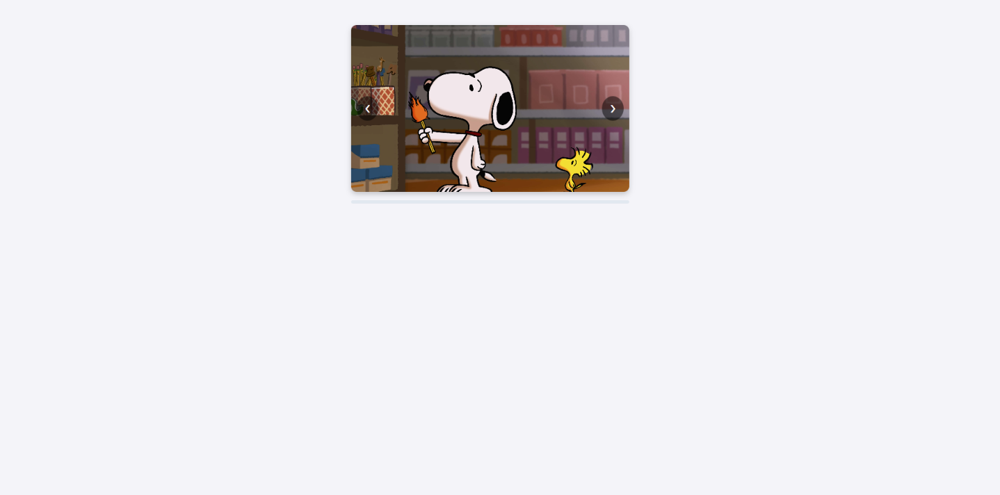
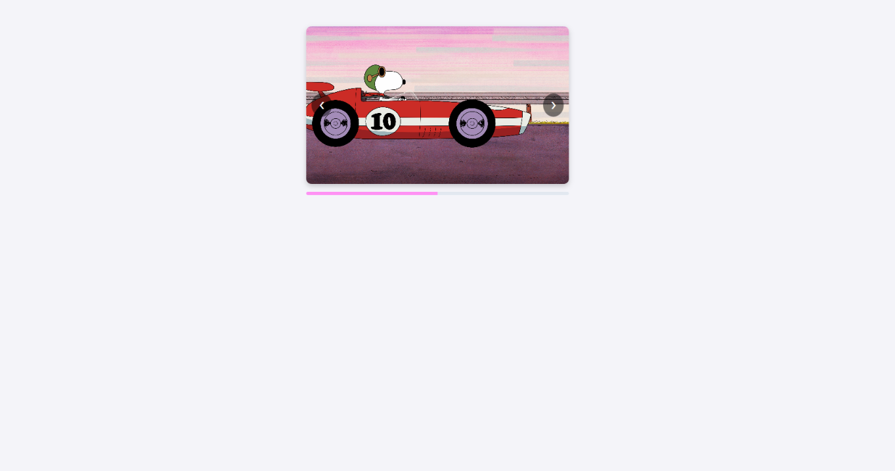
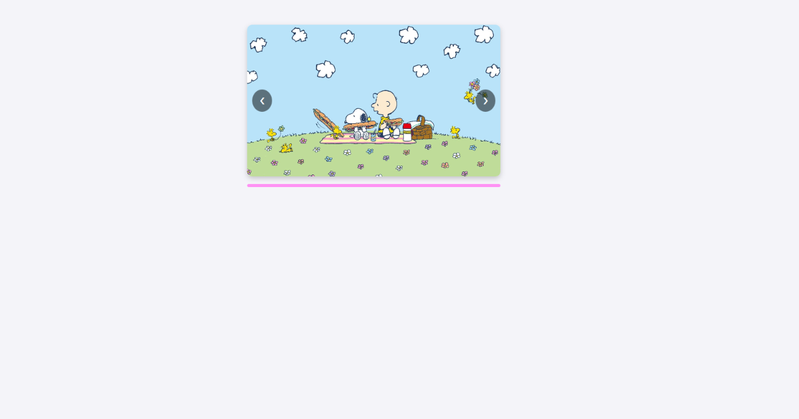

# Componente Visual con JS

**Materia:** Programación Web 

**Autor:**
Luna Cenobio Sarai

**Problema que resuelve:**  
Este componente es muy útil si quieres mostrar imágenes en tu página web de una manera visualmente atractiva y organizada. Resuelve la necesidad de presentar múltiples fotografías en un espacio reducido mediante un carrusel personalizable. Además, incluye una barra de progreso dinámica que indica de forma clara y visual la posición actual del usuario dentro de la galería.

---

## Estructura del Repositorio
El proyecto está organizado de la siguiente manera:

```text
Actividad 3-Componente/
│
├── css/
│   └── componente.css
├── js/
│   └── componente.js
├── img/
│   ├── snoopy1.jpg
│   ├── snoopy3.jpg
│   ├── snoopy4.jpg
│   ├── snoopy5.jpg
│   └── snoopy6.jpg
├── index.html
└── README.md

```
---

## Instalación y uso

Para integrar este componente en cualquier página web HTML, solo debes seguir estos pasos:

### CSS
Agrega la siguiente etiqueta <link> dentro del head de tu archivo HTML para aplicar los diseños del carrusel y la barra de progreso:
```html
<link rel="stylesheet" href="css/componente.css"> 

```
### HTML
Pega la estructura del carrusel y el contenedor de la barra de progreso en el cuerpo <body> de tu página:

```html

<div class="carrusel">
    <div class="carrusel-track" id="track">
        <div class="carrusel-slide">
            
        </div>
        <div class="carrusel-slide">
            
        </div>
    </div>


    <button class="carrusel-btn btn-prev" id="btnPrev">&#10094;</button>
    <button class="carrusel-btn btn-next" id="btnNext">&#10095;</button>
</div>


<div class="carrusel-progress-container">
    <div class="carrusel-progress-bar" id="progressBar"></div>
</div>

```
### JS
Agrega la etiqueta <script> al final del archivo HTML, justo antes de cerrar la etiqueta <body> 

```html
<script src="js/componente.js"></script>

```

## Capturas de pantalla

**Funcionamiento del carrusel**


**Funcionamiento de la barra de progreso**





## Video 
[Video](https://youtu.be/XE3lFLCWg-Y](https://youtu.be/UbtQpcyVfsI)
